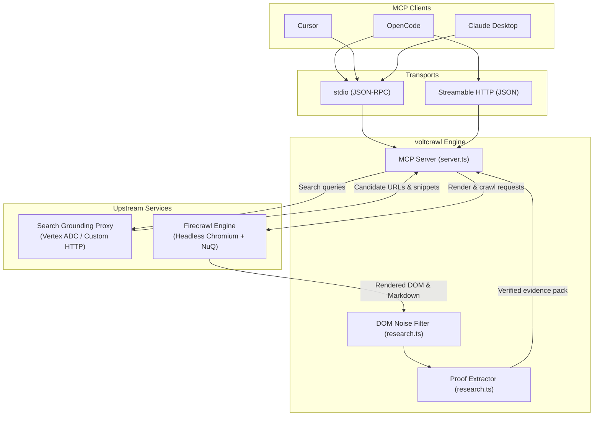
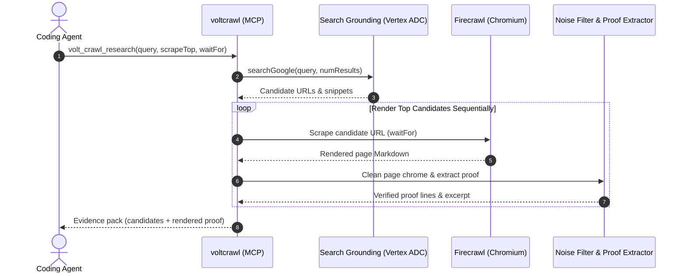
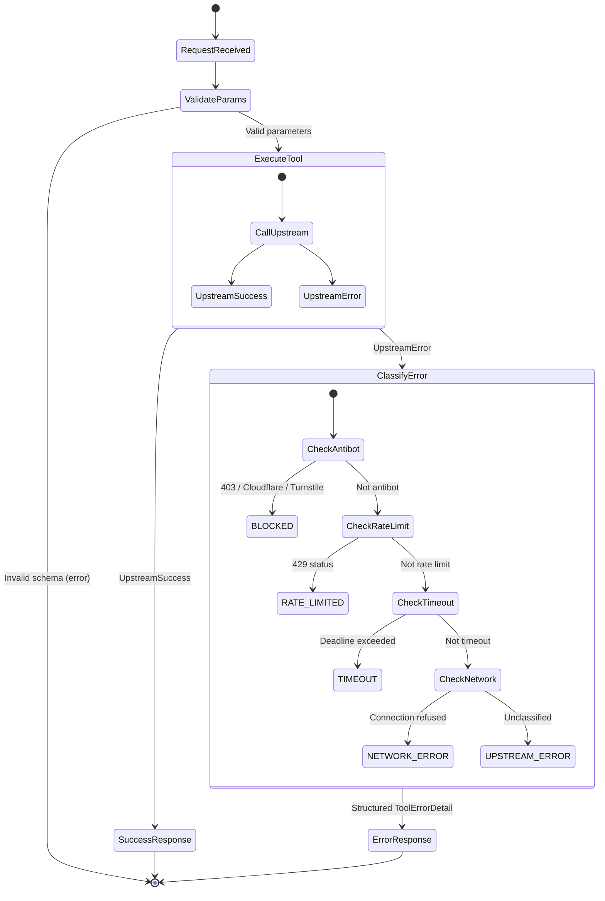

<p align="center">
  <picture>
    <source media="(prefers-color-scheme: dark)" srcset="assets/logo-dark.svg">
    <source media="(prefers-color-scheme: light)" srcset="assets/logo-light.svg">
    
  </picture>
</p>

# voltcrawl

Verified web evidence and headless browser rendering for coding agents.

voltcrawl is an open-source Model Context Protocol (MCP) server that connects AI coding agents to real headless Chromium rendering, sitemap navigation, and search candidate discovery. It strips cookie consent banners, paywalls, and navigation chrome from rendered pages, returning clean Markdown, structured JSON schemas, and verbatim quoted evidence.



---

## Why voltcrawl

AI coding agents need current web information to debug code, verify library APIs, and inspect documentation. Standard web search tools fail agents in two ways:

1. Search indexers return snippet summaries. These snippets frequently contain truncated code, obsolete syntax, or hallucinated facts.
2. Basic HTTP scrapers fail on modern single-page applications. They return blank root containers, cookie consent walls, and scriptless fallbacks.

voltcrawl uses Firecrawl as an honest operational engine for headless browser rendering and sitemap parsing. It pairs that engine with search candidate discovery and deterministic DOM noise filtering. It is not an affiliate pitch or a proprietary cloud wrapper. It connects to any self-hosted Firecrawl instance, local Docker container, or cloud endpoint.

---

## Architecture and highlights

- **Headless Chromium rendering:** Executes client-side JavaScript and single-page applications before extracting text.
- **Deterministic noise filtering:** Strips OneTrust dialogs, cookie banners, ad-block warnings, and navigation sidebars. Preserves author bylines, timestamps, code blocks, and data tables.
- **Truth contract enforcement:** Separates search candidates from rendered evidence. Agents cite verified DOM output rather than search index snippets.
- **Decoupled backends:** Connects to self-hosted Firecrawl instances on localhost or remote hosts. Pairs with Google Search Grounding via Vertex AI ADC, custom search proxies, or offline test doubles.
- **Offline determinism:** Test suites run completely offline without cloud credentials or network connections.

---

## Research workflow

The `volt_crawl_research` tool resolves natural-language questions to verified evidence in a single MCP call:



---

## Quickstart

### Stdio mode (Default)

Connect to a local or remote Firecrawl instance. Run immediately without manual installation:

```bash
export FIRECRAWL_API_URL="http://localhost:3002"

# Run directly via npx
npx voltcrawl

# Or run via bunx
bunx voltcrawl

# Or install globally
npm install -g voltcrawl
voltcrawl
```

### Streamable HTTP mode

Run as a standalone HTTP MCP service with token authentication:

```bash
export MASTER_API_KEY="your-secret-master-token"
export FIRECRAWL_API_URL="http://localhost:3002"

# Launch HTTP server on port 8787
npx voltcrawl --http --port 8787 --host 127.0.0.1
```

Verify service readiness:

```bash
curl http://127.0.0.1:8787/healthz
```

---

## Client configuration

Add voltcrawl to your MCP client configuration file.

### OpenCode

Add to `~/.config/opencode/opencode.json` or your project `opencode.json`:

```json
{
  "mcpServers": {
    "voltcrawl": {
      "type": "local",
      "command": ["npx", "-y", "voltcrawl"],
      "environment": {
        "FIRECRAWL_API_URL": "http://localhost:3002"
      }
    }
  }
}
```

For remote HTTP deployments:

```json
{
  "mcpServers": {
    "voltcrawl": {
      "type": "remote",
      "url": "https://mcp.example.com/mcp",
      "headers": {
        "Authorization": "Bearer YOUR_MASTER_API_KEY"
      },
      "timeout": 180000
    }
  }
}
```

### Cursor

Add to `.cursor/mcp.json` or `~/.cursor/mcp.json`:

```json
{
  "mcpServers": {
    "voltcrawl": {
      "command": "npx",
      "args": ["-y", "voltcrawl"],
      "env": {
        "FIRECRAWL_API_URL": "http://localhost:3002"
      }
    }
  }
}
```

### Claude Desktop / Claude Code

Add to `claude_desktop_config.json` or `.mcp.json`:

```json
{
  "mcpServers": {
    "voltcrawl": {
      "command": "npx",
      "args": ["-y", "voltcrawl"],
      "env": {
        "FIRECRAWL_API_URL": "http://localhost:3002"
      }
    }
  }
}
```

---

## Available tools

The server exposes six tools across HTTP and stdio transports:

| Tool | Parameters | Description |
|---|---|---|
| `volt_crawl_scrape` | `url` *(req)*, `formats`, `onlyMainContent`, `waitFor`, `jsonPrompt`, `jsonSchema` | Renders a target URL with headless Chromium. Extracts Markdown, HTML, or structured JSON. |
| `volt_crawl_search` | `query` *(req)*, `numResults` | Discovers search candidates using Google Search Grounding. Returns ranked URLs, titles, and snippets. |
| `volt_crawl_research` | `query` *(req)*, `numResults`, `scrapeTop`, `waitFor`, `mode`, `maxExcerptChars` | Resolves natural-language questions to verified evidence. Strips DOM noise and pulls verbatim proof lines. |
| `volt_crawl_map` | `url` *(req)*, `search`, `limit` | Traverses domain sitemaps via `sitemap.xml`. Returns an empty list when no sitemap exists. |
| `volt_crawl_crawl` | `url` *(req)*, `limit`, `maxDiscoveryDepth` | Starts asynchronous recursive crawling following links from rendered pages. |
| `volt_crawl_status` | `id` *(opt)*, `includeDocs`, `limitDocs` | Polls crawl job progress or verifies instance readiness. |

---

## Error handling

Failed operations return `{ isError: true }` with structured error categories:



---

## Dependency mapping and packaging

voltcrawl eliminates installation friction for users and agents:

### When running via npx or bunx
- Zero dependency installation. The package ships pre-bundled Node.js and Bun ECMAScript Module artifacts in `dist/`.
- Executing `npx voltcrawl` or `bunx voltcrawl` runs immediately on any system with Node >= 20 or Bun installed.

### When installed via npm
Installing `voltcrawl` automatically pulls in two curated production dependencies:
- **`@modelcontextprotocol/sdk` (`^1.6.1`):** The official Model Context Protocol TypeScript SDK implementing JSON-RPC 2.0 framing, `StdioServerTransport`, and `StreamableHTTPServerTransport`.
- **`zod` (`^3.24.2`):** Type-safe schema validation engine powering all six tool parameter contracts.

### Configuration template
A documented configuration template is included in [`.env.example`](.env.example):
```bash
cp .env.example .env
```

---

## Environment variables

| Variable | Default | Purpose |
|---|---|---|
| `FIRECRAWL_API_URL` | `http://localhost:3002` | Upstream Firecrawl v2 REST endpoint |
| `FIRECRAWL_API_KEY` | *(empty)* | Optional Bearer token for cloud or authenticated Firecrawl |
| `SEARCH_PROXY_URL` | `http://localhost:8088` | Upstream search proxy endpoint for Google Search Grounding |
| `MCP_HTTP_PORT` | `8787` | Port for Streamable HTTP transport |
| `MCP_HTTP_HOST` | `127.0.0.1` | Host binding for HTTP transport |
| `MASTER_API_KEY` | *(empty)* | Enforced on HTTP transport; stdio transport is unauthenticated |

---

## Development and testing

```bash
# Install dependencies
bun install

# Run static typecheck
bun run typecheck

# Run 10 offline test suites (144 tests)
bun test

# Run stdio integration test
bun run tests/stdio-test.ts

# Build production bundle for Node.js
bun run build
```

---

## License

MIT (c) 2026 adi-IL
